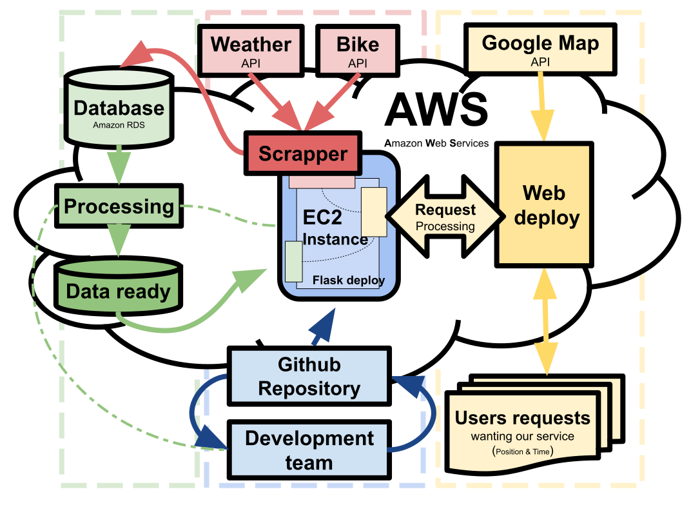

# Bikes-COMP30830 🚴 

A project about bikes for COMP30830 the main objective is to create a Web Application that is able to make prediction about the availability of the bike system using different APIs to collect data and make predictions.

## 🎯 Objetives
This project aims to improve the quality of commuting by providing real-time information about bike station availability and other relevant data.

## ⚙️ What We Want to Include

- Occupancy and Weather
- Total Availability per Station
- Bike Station Positions
- Past Events
- Time of Week
- Weather
- **Bike Stations:**
  - Capacity (Number)
  - Position of Stations
  - Use of Stations
  - Days Changes
- **Web App:**
  - Start/Endpoint Manual Entry
  - Mobile Interface
    - Position of User
    - Map based on Google Maps

## 💡 What Would Be Nice to Have
- GPS
- Battery Information and Prediction of Bikes
- APP'ish' Interface to the Web
- Get Information about the Bike (e.g., electric or not)
- Change Station/Bike Map Appearance Based on Availability

## 🖼️ Structure of the system (Draft)
- The system is based on AWS
- The deployment of the instance is created using flask
- The environment is keep consistent with the development environment by using conda 
- The Web deploy is based on Apache using the AWS infrastructure
- The Data base is MySQL and deployed in the Amazon RDS
- The Direct deployment is based from the main branch in the GitHub repository

## 🛠 ️& 💾 Tools and Repository 
### 🛠 Tools used
- AWS Deploy (EC2 and RDS)
- JSON Request (most probably Python script)
- Flask
- Google Maps API 

### 💾 Repository and resources
- Github
- JCDecaux Developer
- Open Weather

## 👨‍💻👨‍💻👨‍💻 How we want to Implement this project

1. Organize the Planning
2. Plan Data Retrieval
3. Create a Database
4. Develop APIs for Data Retrieval
   - Weather API
   - Bike Stations API
5. Setup Database and connect to scrappers
6. Clean and analyze the data collected 
7. Create an API to interface with the data
8. Use panda to display the information
9. Create an apache server deployment

## 📝 License
This project is licensed under the GPL-3.0 license - see the [LICENSE](LICENSE) file for details.
